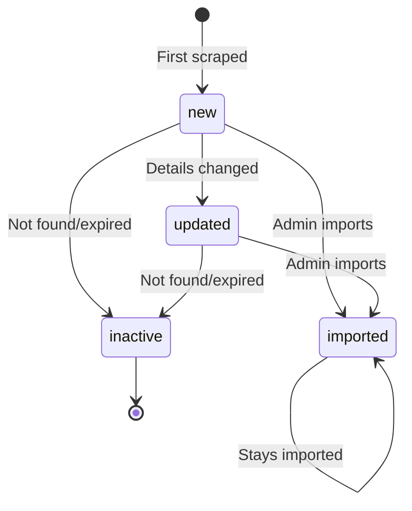

# Sydney Events Platform - Architecture

## System Overview

The Sydney Events Platform is a full-stack MERN application designed to aggregate events from multiple Sydney-based event websites, display them in a modern UI, and provide admin tools for event management.

## Architecture Diagram

```
┌─────────────────────────────────────────────────────────────────┐
│                         FRONTEND                                 │
│  ┌─────────────┐  ┌─────────────┐  ┌─────────────────────────┐  │
│  │  HomePage   │  │  LoginPage  │  │     DashboardPage       │  │
│  │  (Public)   │  │  (OAuth)    │  │     (Protected)         │  │
│  └─────────────┘  └─────────────┘  └─────────────────────────┘  │
│     React 18 + Vite + TailwindCSS + React Router                │
└─────────────────────────────────────────────────────────────────┘
                              │
                              ▼ HTTP/REST
┌─────────────────────────────────────────────────────────────────┐
│                         BACKEND                                  │
│  ┌────────────────────────────────────────────────────────────┐ │
│  │                    Express.js Server                        │ │
│  │  ┌──────────┐  ┌──────────┐  ┌──────────┐  ┌────────────┐  │ │
│  │  │  Auth    │  │  Events  │  │ Tickets  │  │  Passport  │  │ │
│  │  │  Routes  │  │  API     │  │  API     │  │  OAuth     │  │ │
│  │  └──────────┘  └──────────┘  └──────────┘  └────────────┘  │ │
│  └────────────────────────────────────────────────────────────┘ │
│                              │                                   │
│  ┌────────────────────────────────────────────────────────────┐ │
│  │                    Scraper System                           │ │
│  │  ┌───────────┐ ┌───────────┐ ┌─────────────┐ ┌──────────┐  │ │
│  │  │Eventbrite │ │  TimeOut  │ │Ticketmaster │ │  Meetup  │  │ │
│  │  │ Scraper   │ │ Scraper   │ │  Scraper    │ │ Scraper  │  │ │
│  │  └───────────┘ └───────────┘ └─────────────┘ └──────────┘  │ │
│  │                      │                                      │ │
│  │               ┌──────▼──────┐                              │ │
│  │               │   Scrape    │                              │ │
│  │               │   Manager   │                              │ │
│  │               └─────────────┘                              │ │
│  └────────────────────────────────────────────────────────────┘ │
│                              │                                   │
│  ┌────────────────────────────────────────────────────────────┐ │
│  │                 Cron Scheduler (node-cron)                  │ │
│  │                 Runs every 6 hours                          │ │
│  └────────────────────────────────────────────────────────────┘ │
└─────────────────────────────────────────────────────────────────┘
                              │
                              ▼
┌─────────────────────────────────────────────────────────────────┐
│                        DATABASE                                  │
│  ┌────────────────────────────────────────────────────────────┐ │
│  │                      MongoDB                                │ │
│  │  ┌──────────┐  ┌──────────┐  ┌────────────────────────┐    │ │
│  │  │  Events  │  │  Users   │  │    TicketRequests      │    │ │
│  │  │Collection│  │Collection│  │     Collection         │    │ │
│  │  └──────────┘  └──────────┘  └────────────────────────┘    │ │
│  └────────────────────────────────────────────────────────────┘ │
└─────────────────────────────────────────────────────────────────┘
```

## Component Details

### Frontend Components

| Component | Purpose |
|-----------|---------|
| `HomePage` | Public event listing with filters and card grid |
| `LoginPage` | Google OAuth login interface |
| `DashboardPage` | Protected admin view with table and preview |
| `EventCard` | Individual event display with "Get Tickets" CTA |
| `TicketModal` | Email capture modal with consent checkbox |
| `EventTable` | Sortable table view for admin |
| `EventPreview` | Side panel with full event details |

### Backend Services

| Service | Technology | Purpose |
|---------|------------|---------|
| Web Server | Express.js | REST API, session management |
| Authentication | Passport.js | Google OAuth 2.0 |
| Database | Mongoose | MongoDB ODM |
| Scrapers | Puppeteer/Cheerio | Event extraction |
| Scheduler | node-cron | Automated scraping |

### Data Flow

1. **Scraping Pipeline**:
   - Cron triggers every 6 hours
   - Scrapers fetch from 4 sources in sequence
   - Scrape Manager deduplicates and detects changes
   - Events saved/updated in MongoDB with status tags

2. **User Flow (Public)**:
   - User browses events on HomePage
   - Clicks "Get Tickets" → Modal captures email
   - Email saved → Redirect to original event URL

3. **Admin Flow**:
   - Login via Google OAuth
   - View all events in Dashboard table
   - Filter/search/sort events
   - Click row to see preview
   - Click "Import" to mark as imported

### Event Lifecycle



## Security Considerations

- Session-based auth with secure cookies
- CORS restricted to frontend origin
- MongoDB connection via environment variables
- Google OAuth handles credential management
- Rate limiting on scrapers to avoid blocks

## Scalability Notes

- Add Redis for session storage at scale
- Use worker queues for scrapers
- Add more cities by parameterizing scrapers
- Consider CDN for frontend assets
